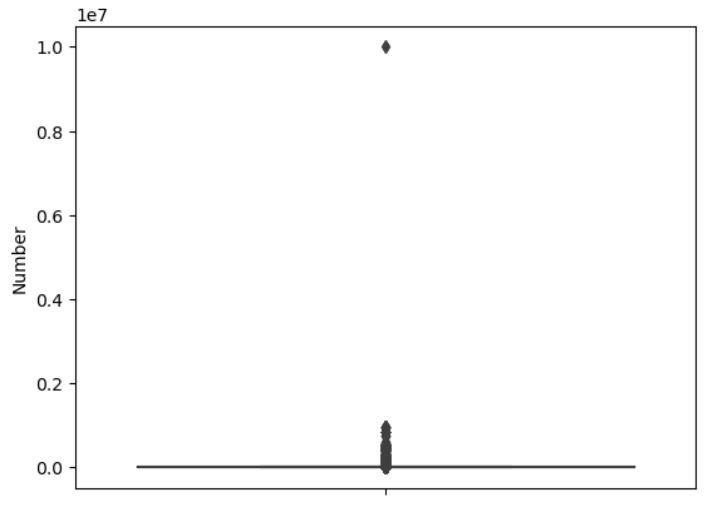

# 1603753-Kaggle-US_Accidents
## Universitat Autònoma de Barcelona
#### Proyecto cas Kaggle de la asignatura de Aprendizaje Computacional sobre los accidentes de tráfico en USA entre los años 2016 y 2021.  
[KAGGLE](https://www.kaggle.com/datasets/sobhanmoosavi/us-accidents?resource=download)

---

# Información del Dataset
## Descripción:
Este dataset se trata de un conjunto de datos sobre accidentes de tráfico en todo el país, que abarca 49 estados de Estados Unidos. Los datos de accidentes se recopilan desde febrero de 2016 hasta diciembre de 2021, utilizando varias API que proporcionan datos de incidentes (o eventos) de tráfico en tiempo real. Estas API difunden datos de tráfico captados por diversas entidades, como los departamentos de transporte de EE.UU. y estatales, los cuerpos de seguridad, las cámaras de tráfico y los sensores de tráfico dentro de las redes de carreteras. Actualmente, hay unos 2,8 millones de registros de accidentes en este conjunto de datos.

## Para que se puede utilizar este dataset
US-Accidents puede utilizarse para numerosas aplicaciones, como la predicción de accidentes en tiempo real, el estudio de puntos críticos de accidentes, el análisis de víctimas y la extracción de reglas de causa y efecto para predecir accidentes, o el estudio del impacto de las precipitaciones u otros estímulos ambientales en la ocurrencia de accidentes.

---

# Data cleaning
**Al analizar estos datos nos encontramos con ciertos atributos que contienen muchos Nans, dependiendo de su tamaño y el valor al que hacen referencia decidimos si eliminar el atributo directamente o rellenar los espacios con el valor de la mediana del atributo.**

**Atributo Number**

Para este atributo observamos la dispersión de sus valores mediante un boxplot
 
